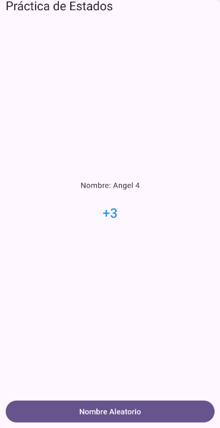
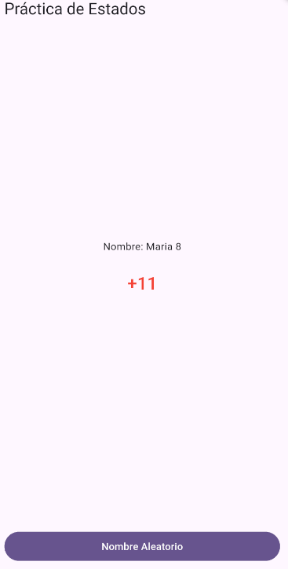

# practica2

A new Flutter project.

## Getting Started

This project is a starting point for a Flutter application.

A few resources to get you started if this is your first Flutter project:

- [Lab: Write your first Flutter app](https://docs.flutter.dev/get-started/codelab)
- [Cookbook: Useful Flutter samples](https://docs.flutter.dev/cookbook)

For help getting started with Flutter development, view the
[online documentation](https://docs.flutter.dev/), which offers tutorials,
samples, guidance on mobile development, and a full API reference.
"# Practica2" 

En la Primera pantalla esta el nombre de un arreglo 
    List<String> nombres = [
      'Juan',
      'Pedro',
      'Ana',
      'Luis',
      'Angel',
      'Fernando',
      'Santiago',
      'Andrea',
      'Maria',
      'Gaby',
      'Marizol',
      'Enrique',
      'Carlos',
      'David',
      'Roberto',
    ];

    coge un valor aleatorio del 0, 14 posiciones

el numero va incrementado de uno en uno mayor a 10 color rojo y llega a 15 vuelve a cero

